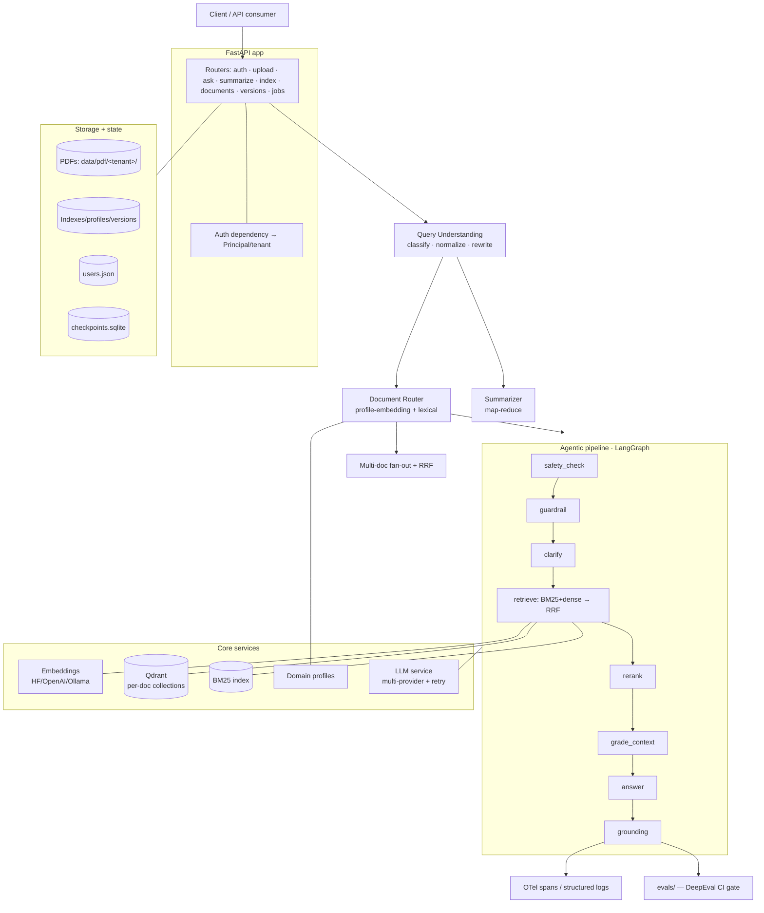
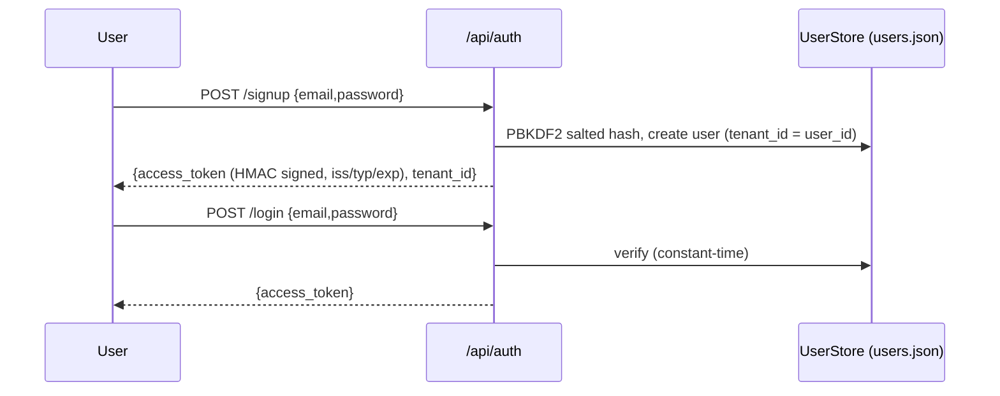
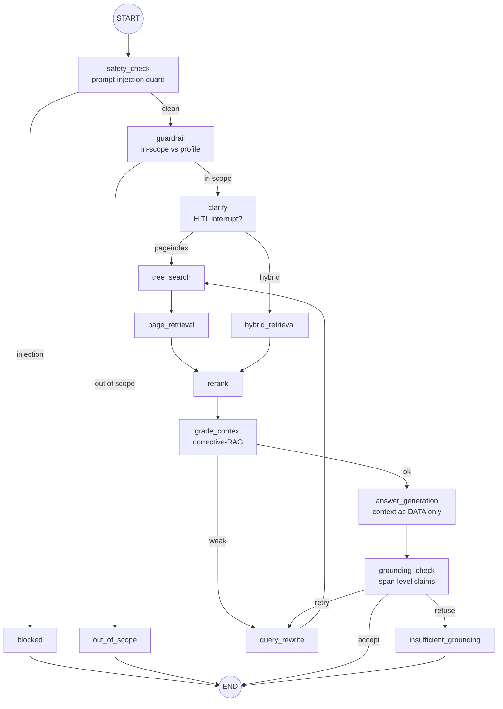
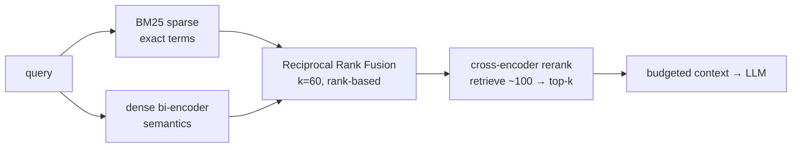
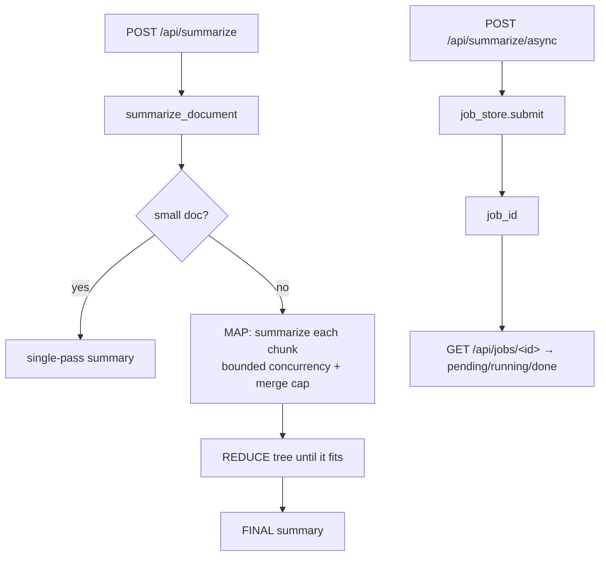
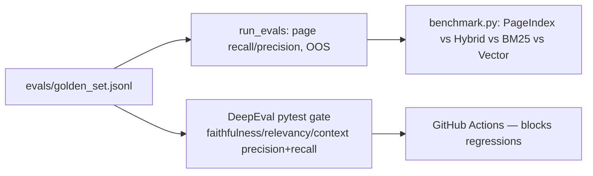

# Vision — Full System Architecture

A multi-tenant **document-intelligence platform**: users sign up, upload documents
(policies, manuals, legal versions, large PDFs), and ask questions or request
summaries. The system understands the query, routes it to the right document(s),
retrieves with a hybrid + reranked pipeline, grounds the answer, and returns
citations + freshness — all tenant-isolated, guardrailed, observable, and
eval-gated.

> This doc is the end-to-end map: layers → data model → every request flow →
> the agentic pipeline → cross-cutting concerns → evaluation → the study labs.

---

## 1. Layered overview



**Layers:** API/auth → query understanding → routing/summarization → agentic
retrieval pipeline → core services (embeddings, vector/BM25, LLM, profiles) →
storage/state. Observability + evaluation wrap everything.

---

## 2. Component map

| File | Responsibility |
|---|---|
| `app/main.py` | App lifecycle; loads all tenant bundles on startup (`registry.load_all`) |
| `app/config.py` | Single settings source (models, retrieval, guardrails, auth, storage, …) |
| `app/deps.py` | `Principal` auth dependency (required / optional → tenant scope) |
| `app/routers/auth.py` | `/api/auth/signup`, `/login` |
| `app/routers/ask.py` | ask · stream · resume · upload · summarize(+async) · index · documents · versions · jobs · config · tree · page · health |
| `app/services/auth.py` | PBKDF2 hashing, signed bearer tokens, `UserStore` |
| `app/services/storage.py` | Pluggable `StorageBackend` (`LocalStorage` per-tenant; S3-ready) |
| `app/services/query_understanding.py` | Classify → normalize → conservative rewrite |
| `app/services/doc_router.py` | Route a query to the best document (profile embedding + lexical) |
| `app/services/multi_doc.py` | Cross-document fan-out + RRF + rerank + answer |
| `app/services/versions.py` | Version chains: register / resolve latest|as-of |
| `app/services/summarize.py` | Map-reduce summarization (fast-path + bounded map) |
| `app/services/jobs.py` | In-memory async job store (submit/poll) |
| `app/services/pipeline.py` | The LangGraph agentic pipeline + `ask`/`ask_streaming`/`resume` |
| `app/services/registry.py` | `CorpusRegistry` of per-`(tenant,doc)` `DocumentBundle`s + namespacing |
| `app/services/indexer.py` | PageIndex (vectorless tree) build/load + page cache |
| `app/services/ingestion.py` | Cross-page chunking (tiktoken) + contextual retrieval + `content_hash` |
| `app/services/hybrid_retrieval.py` | BM25 + Qdrant, RRF, incremental `update()`, shared client |
| `app/services/embeddings.py` | HF/OpenAI/Ollama embeddings (executor + retry) |
| `app/services/reranker.py` | Cross-encoder rerank (graceful fallback) |
| `app/services/domain_profile.py` | Per-document profile (description/topics/persona) |
| `app/services/guardrails.py` | Prompt-injection detection + PII redaction |
| `app/services/llm.py` | Multi-provider LLM + per-request contextvars + retry policy |
| `app/services/retry.py` | Transient-only retry (backoff + jitter + Retry-After) |
| `app/services/observability.py` | OpenTelemetry GenAI spans (no-op when disabled) |
| `evals/` | Golden set + DeepEval CI gate + per-strategy benchmark |

---

## 3. Data & storage model (tenant-isolated)

Every artifact is namespaced by tenant. `ns = <tenant>__<doc>`.

```
data/
├── pdf/<tenant>/<doc>.pdf                 # source PDFs (per-tenant; S3 later)
├── index/<ns>_index.json                  # PageIndex tree
│         <ns>_profile.json                # domain profile
│         <tenant>__versions.json          # version manifest (families)
├── bm25/<ns>_bm25.pkl, <ns>_hybrid_chunks.json
├── qdrant/                                # persistent vectors (collection: vision_<ns>)
├── users.json                             # auth store
└── checkpoints.sqlite                     # LangGraph durable execution
```

A loaded **DocumentBundle** = `{tenant_id, doc_id, document_index (PageIndex),
hybrid_index (BM25+Qdrant), profile, indexed_at}`. The registry resolves bundles
by `(tenant_id, doc_id)`; the active bundle for a request flows via a
**contextvar** (kept out of graph state so the checkpointer stays serializable).

---

## 4. Flow A — Signup / Login



The token is sent as `Authorization: Bearer <token>`; `get_principal` verifies it
and pins the caller to **their tenant** on protected endpoints.

---

## 5. Flow B — Upload & Index (ingestion)

```mermaid
flowchart LR
  U[POST /api/upload + token] --> SV[storage.save_pdf<br/>data/pdf/&lt;tenant&gt;/]
  SV --> ING[ingest_pdf]
  ING --> EX[extract pages<br/>PyMuPDF + tables]
  EX --> CH[cross-page chunk<br/>tiktoken-sized + overlap]
  CH --> CTX{Contextual<br/>Retrieval?}
  CTX -- on --> CTXY[prepend per-chunk context]
  CTX -- off --> EMBED
  CTXY --> EMBED[embed_text → vectors]
  CH --> BM25[BM25 index]
  EMBED --> QD[(Qdrant collection<br/>vision_&lt;ns&gt;)]
  BM25 & QD --> SAVE[save + content_hash]
  SAVE --> REG[registry.load_bundle → profile (LLM)]
  REG --> VER{family+version?}
  VER -- yes --> VS[version_store.register]
  VER --> DONE[UploadResponse]
```

- **Chunking** is cross-page (a fact spanning a page break stays together),
  token-budgeted via tiktoken, with overlap.
- **Contextual Retrieval** (opt-in) prepends an LLM-written context to each chunk
  before embedding (display text preserved).
- **Incremental updates** (`cli update-hybrid` / `HybridIndex.update`) diff by
  `content_hash` and re-embed only changed chunks (stable Qdrant point ids).
- A **domain profile** (description/topics/persona) is derived per document — the
  signal the router later uses.

---

## 6. Flow C — Ask (the core path)

```mermaid
flowchart TD
  Q[POST /api/ask + token] --> T[resolve tenant from Principal]
  T --> QU[Query Understanding: classify + normalize + rewrite]
  QU --> ICH{intent?}
  ICH -- chitchat --> CH[answer directly, no retrieval]
  ICH -- other --> FAM{family given?}
  FAM -- yes --> VRES[version_store.resolve latest|as_of → doc_id]
  FAM -- no --> CMP
  VRES --> CMP{intent == compare<br/>and no doc?}
  CMP -- yes --> MD[multi_doc_ask: route top-N → RRF → rerank → answer]
  CMP -- no --> RTE[doc_router.route → doc_id]
  RTE --> SUMI{intent == summarize?}
  SUMI -- yes --> SUM[summarize_document map-reduce]
  SUMI -- no --> PIPE[agentic pipeline ask(search_query, doc_id)]
  PIPE --> RESP[AskResponse: answer + citations + intent + freshness]
  MD --> RESP
  SUM --> RESP
  CH --> RESP
```

So one `/ask` call is **understood, then branched**: chit-chat answers directly;
`summarize` map-reduces; `compare` fans out across documents; everything else
routes to the single best document (or a resolved version) and runs the pipeline.
The **rewritten** query drives routing + retrieval; the response echoes the user's
original query plus `query_intent` and `understood_query`.

---

## 7. The agentic pipeline (LangGraph)



- **safety_check** → blocks prompt-injection (input guardrail).
- **guardrail** → scope check vs the document's profile (out-of-scope → polite redirect).
- **clarify** → HITL: if ambiguous, `interrupt()` and ask; resume via `/api/ask/resume`.
- **retrieve** → PageIndex (vectorless tree reasoning) *or* hybrid (BM25+dense→RRF).
- **rerank** → cross-encoder narrows candidates to the most relevant.
- **grade_context** → corrective-RAG: weak context → rewrite + re-retrieve (bounded).
- **answer** → grounded generation; retrieved text wrapped as untrusted DATA.
- **grounding_check** → decompose answer into claims, verify each; accept / retry / **refuse**.
- Output is PII-redacted; durable execution via the SQLite checkpointer (thread_id).

---

## 8. Retrieval internals



Hybrid because lexical catches codes/jargon dense smooths away, and dense catches
paraphrases lexical misses; **RRF** fuses on rank (no score-scale issues); the
**cross-encoder** rerank is the biggest precision lift; an embedding-dim guard
forces a rebuild if the embedding model changes.

---

## 9. Flow D — Summarize (sync + async) & Versioning



**Versioning:** upload with `family`+`version`(+`effective_date`) registers a
version; `/api/ask?family=…&as_of=…` resolves to the **latest** (or as-of)
version's `doc_id`; `GET /api/versions` lists chains.

---

## 10. Cross-cutting concerns

| Concern | How |
|---|---|
| **Multi-tenancy** | Per-tenant storage dirs + `<tenant>__<doc>` artifacts + per-tenant Qdrant collections; auth pins callers to their tenant; active doc via contextvar |
| **Concurrency** | Per-request provider/model + active-document via **contextvars** (task-isolated; no global mutation) |
| **Guardrails** | Input: prompt-injection block; context treated as untrusted DATA; Output: grounding refuse + **PII redaction** |
| **Durability** | LangGraph **AsyncSqliteSaver** checkpointer → resume/replay; HITL interrupts |
| **Observability** | OpenTelemetry **GenAI semantic-convention** spans (LLM calls, nodes, request) → OTLP/Langfuse; no-op when disabled |
| **Resilience** | LLM/embeddings **timeouts + transient-only retry** (exp backoff + full jitter + Retry-After) |
| **Freshness** | `indexed_at` per doc, surfaced on every answer |
| **Config** | One `Settings` object; everything env-toggleable (`.env.example`) |

---

## 11. Evaluation



Thresholds (2026): faithfulness ≥ 0.75, answer-relevancy ≥ 0.80, context-precision
≥ 0.70, context-recall ≥ 0.80. CI runs structure checks always; the LLM-judge gate
runs when a judge key is present.

---

## 12. Standalone study labs (decoupled from the app)

Runnable offline, each web-researched + benchmarked; the app wires these ideas for real.

| Lab | Covers |
|---|---|
| `chunking/` | fixed · recursive · sentence · markdown · parent-child · semantic · late · contextual · proposition · agentic |
| `embeddings/` | prefixes · pooling · normalize · Matryoshka · int8/binary quant · dense · sparse(SPLADE) · multi-vector(ColBERT) |
| `retrieval/` | BM25 · dense · hybrid+RRF · HyDE/multi-query/decomp/step-back · rerankers · recall@k/nDCG/MRR |
| `evaluation/` | RAGAS-style faithfulness · answer-relevancy · context-precision · context-recall |
| `agents/` | ReAct loop · tools w/ metadata+flags · secure runner (validation/approval/logging) · memory · multi-agent · **MCP** |

See [RAG_FUNDAMENTALS.md](RAG_FUNDAMENTALS.md) for how the first four stitch together.

---

## 13. Tech stack

FastAPI · LangGraph (durable, checkpointer, interrupts) · Qdrant (persistent,
per-doc collections) · BM25 (rank-bm25) · sentence-transformers / OpenAI / Ollama
embeddings + cross-encoder reranker · PyMuPDF + pdfplumber · tiktoken · OpenTelemetry
· DeepEval/Ragas (evals). Multi-provider LLM (OpenAI/Azure/OpenRouter/Groq/Gemini/Ollama).

---

## 14. End-to-end, in one sentence

A user **signs up**, **uploads** documents (stored per-tenant, chunked,
optionally context-enriched, embedded into BM25 + per-doc vector collections,
profiled, optionally versioned); on **ask**, the query is **understood**
(classified/normalized/rewritten), **routed** to the right document (or version,
or fanned out across several), retrieved via **hybrid + RRF + rerank**, answered
under **safety/scope/grounding guardrails** with **PII redaction**, and returned
with **citations + freshness** — all **tenant-isolated, observable, durable, and
eval-gated**.

---

## 15. Honest production roadmap (not yet built / next)

- **Layout-aware parsing** (tables/multi-column) via Unstructured/LlamaParse before chunking.
- **Span-level grounding for the multi-doc path** (parity with single-doc).
- **Persistent job store** (Redis/DB + worker) instead of in-memory.
- **Calibrated confidence** (retrieval-signal based, not LLM self-score).
- **OAuth/JWT + argon2id** for auth; **org-level tenants** (many users → one tenant).
- **Lazy bundle loading + eviction** for many tenants × many docs.
- **Online evals** on sampled production traffic (Langfuse) in addition to the CI gate.
